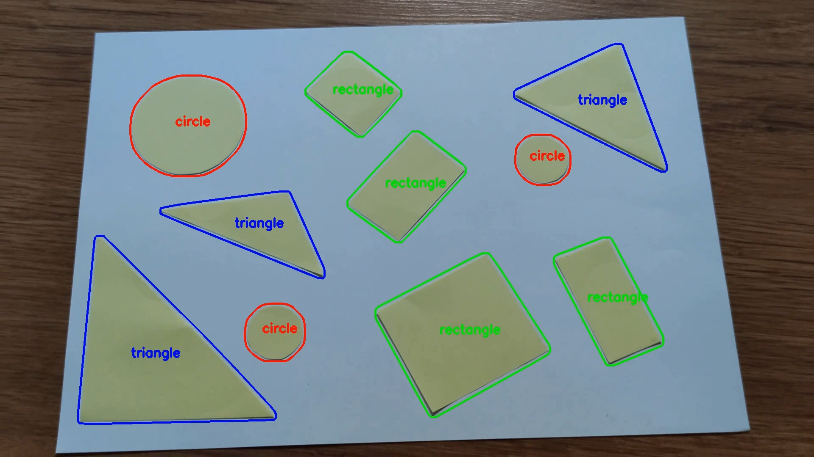

# Shapes detector

Detecting figures shapes.

Classical Computer Vision approach.




## Algorithm

1. Select ROIs of figures by their color using defined range of values of Hue channel of HSV (Hue Saturation Value) image representation;

2. Remove trash using Morphology operations: dilation and errosion;

3. Use OpenCV findContours method to find contours (obviously);

4. Get convex hull of the shapes;

5. Approximate polygon with cv2.approxPolyDP;

6. Count corners.

<br>

Some twist and tweaks are made along the implementation, see the code for more details.


## Reproduce

Create virtual environment with pyenv:

    $ python3 -m venv env

Activate environment and install dependencies:

    $ source ./env/bin/activate
    $ pip3 install opencv-python

Place the input video in folder ```input``` and run the detector:

    $ python3 detect_shapes.py
